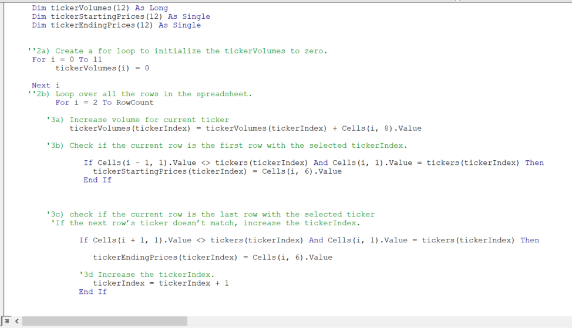
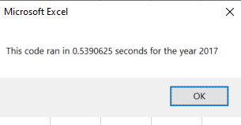
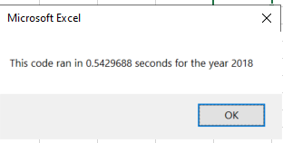

# Stock-Analysis(Refacterd code) using VBA
## Overview of the Project

### Background of the project
Steve recently graduated with his finance degree and he wants to help his parents to take right decision on their invesment.Steve parents are passionate about green energy and they believe fossil fuels will get used up and as time passes,they will also be more and more dependebility on alternative enegy.So, Stevs parents have decided to put all their money on "DAQO Energy COrp.(DAQO's ticker symbol is DQ) without proper research.

On behalf of his parents,he wants to analyze the data set for DQ's before move forward with the decision.So,Steve wants to find the total daily volume and yearly return for DQ stock.

Daily volume is the total number of shares traded throughout the day;it measures how actively a stock being traded.The yearly return is precentage difference in price from beginning to ene of the year.Steve's parents are starting to pester him about DAQO's stock,and Steve wants to know how DQ performed in 2018.

I am assisting Steve on analyzing the DQ data realized that it dropped over 63% in 2018.Since DQ is not good move to take,I analyzed all other stock's daily volume and return for year 2018.

Further,to provide more user friendliness,I added buttons to analyze the entire data set for different years (2017 and 2018).Also added timer to calculate the performence of code.

Additionally,Steve wants to expand his reserch by expanding the dataset and include the entire stock market over the last few years.

### Purpose of the Project

In this challenge, I refactored, the earlier script to produce more efficient code to analyze the entire stock market.

## Results
### Performence Between 2017 & 2018
- The following is the output  tables for Year 2017 & 2018:

  
  
 - The below images shows the performence between 2017 & 2018 worksheets according to All stock analysis script:

  

 - We can say there is no significant difference in time to run code years 2018 & 2017 worksheet because we are using the same code.

### Performance between original script & refactored script
- When refactoring the script I added 3 output arrays to represent:
  - tickerVolume
  - tickerStartingPrice
  - tickerEndingPrice
 - And used those arrays to calculate volume, starting price, and ending price for each ticker.
 - The below image shows the part of the code that I mainly added when refactoring the code.

 
 
 - Finally, if we consider the time between refactored script & All Stock Analysis Stock it has a significant time difference.
   - Time to run refactored code for year 2017
   
                
  
    - Time to run code before refactoring for year 2017
   
      
 
    - Time to run refactored code for year 2018

      
 
    - Time to run code before refactoring for year 2018
 
       
       
       
 ## Summary
 
 ### Advantages and disadvantages of refactoring code in general:
 #### Advantages
 Maintainability: After refactoring,the code is easier to understand and read, less complex and easier to maintain.
 #### Disadvantages
 Disadvantages of code refactoring :time consuming:You may have no idea how much time it may take to complete the process. It may also land you in a situation where you have no idea where to go.
 
 ### Pros and Cons of this project:
 If considering Refactored All Stock Analysis script it's performence increased significantly. So now Steve can use this workbook to analyze entire stock market and he can easily maintain it now with Arrays.
 Disadvantages, this process is time consuming, and additionally, there is always room for improvement so you do not if you can improve the performance more and how you can improve the performance more. 
 
 
