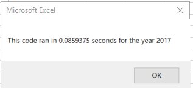
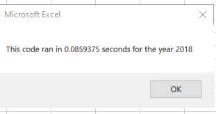

# Stock-Analysis(Refacterd code) using VBA
## Overview of the Project
### Background of the project
### Purpose of the Project

## Results
### Perfermence Between 2017 & 2018
- Following is the output  tables results from Allstock analysis:

  
  
 - Following is the performence between 2017 & 2018 worksheets according to All stock analysis script:

  
