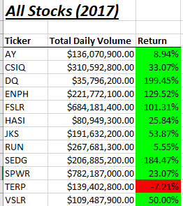
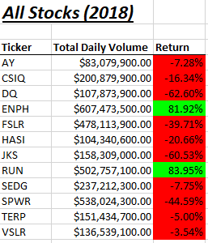

# Stock-Analysis(Refacterd code) using VBA
## Overview of the Project
### Background of the project
### Purpose of the Project

## Results
### Perfermence Between 2017 & 2018
- If we consider performence between 2017 & 2018 worksheets according to All stock analysis script:
- 

 
